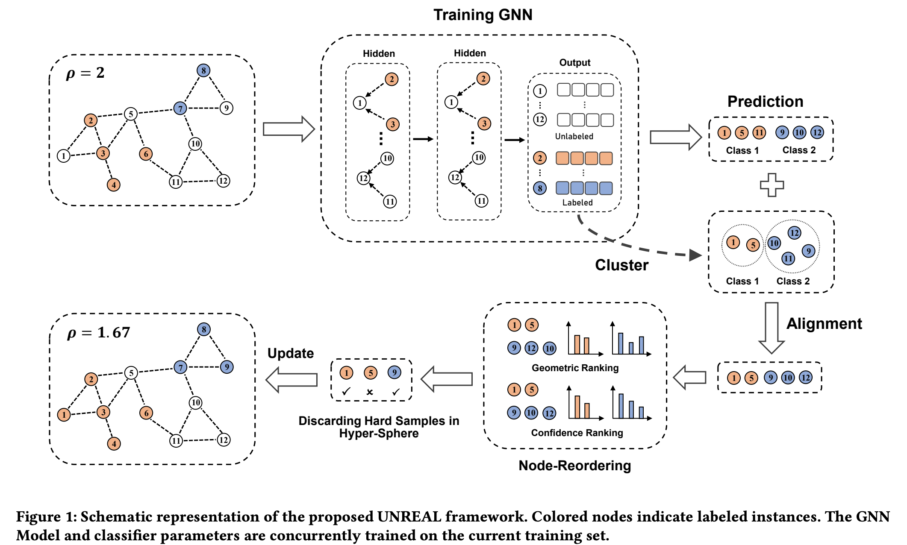

# Revisiting Semi-Supervised Imbalanced Node Classification with Unlabeled Data (Submitted to KDD 2024)

## Introduction

Official Pytorch implementation of KDD 2024 Submitted Paper  "Revisiting Semi-Supervised Imbalanced Node Classification with Unlabeled Data"

**Introduction:** In graph-based learning, addressing imbalanced label distributionsis essential to real-world applications, especially given the complexity of graph structures. While a majority of research has focused on methods like oversampling, data augmentation, and re-weighting w.r.t. graph topology, the self-training approach avoiding increasing the extra complexities when synthesizing new neighbors emerges as a promising strategy. By leveraging unlabeled nodes to augment the training dataset, it avoid the extra complexities when synthesizing new neighbors naturely. Yet, in this work, both theoretically and empirically, we pinpoint significant shortcomings in Vanilla self-training when grappling with class imbalances, particularly concerning pseudolabel accuracy and confidence reliability, hard sample in representation space. From these insights, we introduce an innovative approach that redefines pseudolabels and confidence assessments in the latent space, thereby rejuvenating the efficacy of self-training in imbalanced learning scenarios. Comprehensive tests on real-world benchmark datasets underscore our method’s performance over prevailing state-of-the-art techniques.

## Environment
```bash
conda create -n "unreal" python=3.8.13
source activate unreal
conda install pytorch==1.12.1 torchvision==0.13.1 torchaudio==0.12.1 cudatoolkit=11.3 -c pytorch
pip install torch_geometric
pip install https://data.pyg.org/whl/torch-1.12.0%2Bcu113/pyg_lib-0.3.1%2Bpt112cu113-cp38-cp38-linux_x86_64.whl
pip install https://data.pyg.org/whl/torch-1.12.0%2Bcu113/torch_cluster-1.6.0%2Bpt112cu113-cp38-cp38-linux_x86_64.whl
pip install https://data.pyg.org/whl/torch-1.12.0%2Bcu113/torch_scatter-2.1.0%2Bpt112cu113-cp38-cp38-linux_x86_64.whl
pip install https://data.pyg.org/whl/torch-1.12.0%2Bcu113/torch_sparse-0.6.16%2Bpt112cu113-cp38-cp38-linux_x86_64.whl
pip install https://data.pyg.org/whl/torch-1.12.0%2Bcu113/torch_spline_conv-1.2.1%2Bpt112cu113-cp38-cp38-linux_x86_64.whl
```
## Training Hyperparameters
### Cora-Semi (imbalance ratio= 10, 20, 50, 100)
- Cora-GCN (imbalance ratio= 10)
  ```bash
  python main.py --dataset Cora --repetitions 5 --imb_ratio 10 --net GCN  --rounds 40 --ad 4 --rbo 0.5 --threshold 0.25
  ```
- Cora-GAT (imbalance ratio= 10)
  ```bash
  python main.py --dataset Cora --repetitions 5 --imb_ratio 10 --net GAT  --rounds 40 --ad 4 --rbo 0.5 --threshold 0.25
  ```
- Cora-SAGE (imbalance ratio= 10)
  ```bash
  python main.py --dataset Cora --repetitions 5 --imb_ratio 10 --net SAGE  --rounds 40 --ad 4 --rbo 0.5 --threshold 0.25
  ```
- Cora-GCN (imbalance ratio= 20)
  ```bash
  python main.py --dataset Cora --repetitions 5 --imb_ratio 20 --net GCN  --rounds 40 --ad 4 --rbo 0.5 --threshold 0.25
  ```
- Cora-GAT (imbalance ratio= 20)
  ```bash
  python main.py --dataset Cora --repetitions 5 --imb_ratio 20 --net GAT  --rounds 40 --ad 4 --rbo 0.5 --threshold 0.25
  ```
- Cora-SAGE (imbalance ratio= 20)
  ```bash
  python main.py --dataset Cora --repetitions 5 --imb_ratio 20 --net SAGE  --rounds 40 --ad 4 --rbo 0.5 --threshold 0.25
  ```
- Cora-GCN (imbalance ratio= 50)
  ```bash
  python main.py --dataset Cora --repetitions 5 --imb_ratio 50 --net GCN  --rounds 40 --ad 4 --rbo 0.5 --threshold 0.25
  ```
- Cora-GAT (imbalance ratio= 50)
  ```bash
  python main.py --dataset Cora --repetitions 5 --imb_ratio 50 --net GAT  --rounds 40 --ad 4 --rbo 0.5 --threshold 0.25
  ```
- Cora-SAGE (imbalance ratio= 50)
  ```bash
  python main.py --dataset Cora --repetitions 5 --imb_ratio 50 --net SAGE  --rounds 40 --ad 4 --rbo 0.5 --threshold 0.25
  ```
- Cora-GCN (imbalance ratio= 100)
  ```bash
  python main.py --dataset Cora --repetitions 5 --imb_ratio 100 --net GCN  --rounds 40 --ad 4 --rbo 0.5 --threshold 0.25
  ```
- Cora-GAT (imbalance ratio= 100)
  ```bash
  python main.py --dataset Cora --repetitions 5 --imb_ratio 100 --net GAT  --rounds 40 --ad 4 --rbo 0.5 --threshold 0.25
  ```
- Cora-SAGE (imbalance ratio= 100)
  ```bash
  python main.py --dataset Cora --repetitions 5 --imb_ratio 100 --net SAGE  --rounds 40 --ad 4 --rbo 0.5 --threshold 0.25
  ```

### CiteSeer-Semi (imbalance ratio= 10, 20, 50, 100)
- CiteSeer-GCN (imbalance ratio= 10)
  ```bash
  python main.py --dataset CiteSeer --repetitions 5 --imb_ratio 10 --net GCN  --rounds 10 --ad 5 --rbo 0.5 --threshold 0.25
  ```
- CiteSeer-GAT (imbalance ratio= 10)
  ```bash
  python main.py --dataset CiteSeer --repetitions 5 --imb_ratio 10 --net GAT  --rounds 10 --ad 5 --rbo 0.5 --threshold 0.25
  ```
- CiteSeer-SAGE (imbalance ratio= 10)
  ```bash
  python main.py --dataset CiteSeer --repetitions 5 --imb_ratio 10 --net SAGE  --rounds 10 --ad 5 --rbo 0.5 --threshold 0.25
  ```
- CiteSeer-GCN (imbalance ratio= 20)
  ```bash
  python main.py --dataset CiteSeer --repetitions 5 --imb_ratio 20 --net GCN  --rounds 10 --ad 5 --rbo 0.5 --threshold 0.25
  ```
- CiteSeer-GAT (imbalance ratio= 20)
  ```bash
  python main.py --dataset CiteSeer --repetitions 5 --imb_ratio 20 --net GAT  --rounds 10 --ad 5 --rbo 0.5 --threshold 0.25
  ```
- CiteSeer-SAGE (imbalance ratio= 20)
  ```bash
  python main.py --dataset CiteSeer --repetitions 5 --imb_ratio 20 --net SAGE  --rounds 10 --ad 5 --rbo 0.5 --threshold 0.25
  ```
- CiteSeer-GCN (imbalance ratio= 50)
  ```bash
  python main.py --dataset CiteSeer --repetitions 5 --imb_ratio 50 --net GCN  --rounds 10 --ad 5 --rbo 0.5 --threshold 0.25
  ```
- CiteSeer-GAT (imbalance ratio= 50)
  ```bash
  python main.py --dataset CiteSeer --repetitions 5 --imb_ratio 50 --net GAT  --rounds 10 --ad 5 --rbo 0.5 --threshold 0.25
  ```
- CiteSeer-SAGE (imbalance ratio= 50)
  ```bash
  python main.py --dataset CiteSeer --repetitions 5 --imb_ratio 50 --net SAGE  --rounds 10 --ad 5 --rbo 0.5 --threshold 0.25
  ```
- CiteSeer-GCN (imbalance ratio= 100)
  ```bash
  python main.py --dataset CiteSeer --repetitions 5 --imb_ratio 100 --net GCN  --rounds 10 --ad 5 --rbo 0.5 --threshold 0.25
  ```
- CiteSeer-GAT (imbalance ratio= 100)
  ```bash
  python main.py --dataset CiteSeer --repetitions 5 --imb_ratio 100 --net GAT  --rounds 10 --ad 5 --rbo 0.5 --threshold 0.25
  ```
- CiteSeer-SAGE (imbalance ratio= 100)
  ```bash
  python main.py --dataset CiteSeer --repetitions 5 --imb_ratio 100 --net SAGE  --rounds 10 --ad 5 --rbo 0.5 --threshold 0.25
  ```

### PubMed-Semi (imbalance ratio= 10, 20, 50, 100)
- PubMed-GCN (imbalance ratio= 10)
  ```bash
  python main.py --dataset  PubMed --repetitions 5 --imb_ratio 10 --net GCN  --rounds 40 --ad 4 --rbo 0.5 --threshold 0.25
  ```
- PubMed-GAT (imbalance ratio= 10)
  ```bash
  python main.py --dataset  PubMed --repetitions 5 --imb_ratio 10 --net GAT  --rounds 40 --ad 4 --rbo 0.5 --threshold 0.25
  ```
- PubMed-SAGE (imbalance ratio= 10)
  ```bash
  python main.py --dataset  PubMed --repetitions 5 --imb_ratio 10 --net SAGE  --rounds 40 --ad 4 --rbo 0.5 --threshold 0.25
  ```
- PubMed-GCN (imbalance ratio= 20)
  ```bash
  python main.py --dataset  PubMed --repetitions 5 --imb_ratio 20 --net GCN  --rounds 40 --ad 4 --rbo 0.5 --threshold 0.25
  ```
- PubMed-GAT (imbalance ratio= 20)
  ```bash
  python main.py --dataset  PubMed --repetitions 5 --imb_ratio 20 --net GAT  --rounds 40 --ad 4 --rbo 0.5 --threshold 0.25
  ```
- PubMed-SAGE (imbalance ratio= 20)
  ```bash
  python main.py --dataset  PubMed --repetitions 5 --imb_ratio 20 --net SAGE  --rounds 40 --ad 4 --rbo 0.5 --threshold 0.25
  ```
- PubMed-GCN (imbalance ratio= 50)
  ```bash
  python main.py --dataset  PubMed --repetitions 5 --imb_ratio 50 --net GCN  --rounds 40 --ad 4 --rbo 0.5 --threshold 0.25
  ```
- PubMed-GAT (imbalance ratio= 50)
  ```bash
  python main.py --dataset  PubMed --repetitions 5 --imb_ratio 50 --net GAT  --rounds 40 --ad 4 --rbo 0.5 --threshold 0.25
  ```
- PubMed-SAGE (imbalance ratio= 50)
  ```bash
  python main.py --dataset  PubMed --repetitions 5 --imb_ratio 50 --net SAGE  --rounds 40 --ad 4 --rbo 0.5 --threshold 0.25
  ```
- PubMed-GCN (imbalance ratio= 100)
  ```bash
  python main.py --dataset  PubMed --repetitions 5 --imb_ratio 100 --net GCN  --rounds 40 --ad 4 --rbo 0.5 --threshold 0.25
  ```
- PubMed-GAT (imbalance ratio= 100)
  ```bash
  python main.py --dataset  PubMed --repetitions 5 --imb_ratio 100 --net GAT  --rounds 40 --ad 4 --rbo 0.5 --threshold 0.25
  ```
- PubMed-SAGE (imbalance ratio= 100)
  ```bash
  python main.py --dataset  PubMed --repetitions 5 --imb_ratio 100 --net SAGE  --rounds 40 --ad 4 --rbo 0.5 --threshold 0.25
  ```


## Baselines
### The Implementation of Baselines and the Configuration of Hyperparameters
- For the implementation and hyperparameters setting of **Re-Weight, PC Softmax, BalancedSoftmax, TAM**, please refer to [TAM](https://github.com/Jaeyun-Song/TAM).
- For the implementation and hyperparameters setting of **GraphSmote**, please refer to [GraphSmote](https://github.com/TianxiangZhao/GraphSmote).
- For the implementation and hyperparameters setting of **Renode**, please refer to [Renode](https://github.com/victorchen96/ReNode).
- For the implementation and hyperparameters setting of **GraphENS**, please refer to [GraphENS](https://github.com/JoonHyung-Park/GraphENS).

We strictly adhere to the hyperparameter settings as specified in these papers. For detailed information, please refer to the respective publications.


## Configuration
All the algorithms and models are implemented in Python and PyTorch Geometric. Experiments are
conducted on a server with an NVIDIA 3090 GPU (24 GB memory) and an Intel(R) Xeon(R) Silver
4210R CPU @ 2.40GHz.


